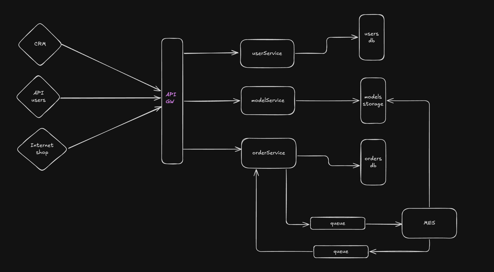

### Проанализировав текущую архитектуру, могу выявить следующие проблемы и их причины:

1. **Долгое ожидание расчёта стоимости заказа**.
   - Расчёт выполняется в MES, который был куплен с исходным кодом и не оптимизирован.
   - Отсутствует асинхронная обработка: пользователь ждёт расчёта в реальном времени.
   - Используется один инстанс MES, который не масштабируется горизонтально.

2. **Зависание заказов и нарушение сроков доставки**.
   - Приоритет на новые заказы.
   - Нет контроля за зависшими заказами.
   - Нет автоматического уведомления при задержках.

3. **Жалобы от API-пользователей (B2B)**.
   - Высокая нагрузка на API из-за роста заказов.
   - Нет ограничений на частоту запросов. 
   - Отсутствие кеширования.

4. **Замедление работы MES при загрузке дашборда операторов**.
   - Нет оптимальной индексации в базе данных.
   - Нет кеширования списка заказов.

5. **Недостаточный мониторинг и логирование**.
   - Нет централизованного логирования.
   - Разработчики узнают о проблемах только от клиентов.
   - Нет алертов по критическим сбоям.

6. **Отсутствие масштабируемости**.
   - Каждый сервис работает на одном инстансе.
   - БД не масштабируется, все запросы идут в один инстанс.

### Для решения перечисленных проблем предлагаю следующие решения:

1. **Оптимизация расчёта стоимости в MES**
   - Разбить сервис MES на два: один будет отвечать за предоставления API для работы с заказами, второй только за расчет стоимости модели
   - Внедрить очередь сообщений, чтобы не блокировать пользователя.
   - Разделить API на синхронную и асинхронную часть: сначала дать пользователю ориентировочную цену, потом точную.
   - Кешировать результаты для популярных 3D-моделей.
   - Использовать авто-масштабирование в облаке для сервиса расчета стоимости, так как расчет может занимать до 30 минут

2. **Улучшение управления заказами**
   - Настроить автоматический алертинг при долгом нахождении заказа в одном статусе.
   - Внедрить трейсинг, чтобы видеть, где застрял заказ.
   - Логировать все изменения статусов заказов.

3. **Ускорение работы API**
   - Использовать API Gateway для контроля нагрузки.
   - лимитировать RPS для каждого клиента.
   - Отслеживать метрики: RPS, HTTP 500, время отклика.
   - Включить логирование всех ошибок API.

4. **Оптимизация MES-дэшборда**
   - Добавить индексы на часто используемые поля, например, статус заказа.
   - Кешировать запросы к дашборду в Redis.
   - Ограничить количество загружаемых записей

5. **Внедрение трейсинга и логирования**
   - Собрать логи из всех сервисов в единую систему.
   - Уведомления при HTTP 500, высокой нагрузке, зависших заказах.

6. **Масштабирование системы**
   - Перевести API и CRM на авто-масштабируемые инстансы.
   - Разделить базы на чтение и запись.

---

### Приоритетные инициативы 
На мой взгляд приоритет стоит отдать проблемам пользователей, которые совершают заказы через сайт или API.
Пользователи жалуются на долгую обработку заказов, чтобы ускорить обработку заказов, необходимо в первую очередь изменить приоритет выбора заказа операторами на MES-дашборде.
Сейчас они стараются забрать самый новый заказ, из-за чего старые заказы могут оставаться без внимания долгое время. 
Необходимо, чтобы оператор стремился забрать самый старый заказ, для этого надо изменить систему вознаграждения соответствующим образом.
Также необходимо улучшить производительность самого дашборда. Для этого необходимо разделить функционал MES на два сервиса, 
как было описано выше. Можно оставить текущую реализацию MES только для расчета стоимости модели и написать новый сервис, 
который бы работал только с базой данных заказов. 
Можно оставить текущую реализацию MES только для расчета стоимости модели и написать новый сервис, который бы работал только с базой данных заказов.
Вследствие этого, загрузка дашборда больше не будет зависеть от расчета стоимости, а сервис MES можно запустить в несколько инстансов, 
что ускорит расчет стоимости для разных пользователей.
И чтобы максимизировать пользу от разделения сервиса необходимо добавить очередь, в которую будут попадать запросы на расчет 
стоимости модели, а свободный инстанс MES будет забирать сообщение из очереди и выполнять расчет заказа. 
Пока стоимость не рассчитана, пользователь будет видеть примерную стоимость.

В то же время, необходимо повысить наблюдаемость системы, так как сейчас невозможно своевременно реагировать на ошибки и сбои, 
потому о проблемах узнают только от пользователей. Для этого необходимо внедрить систему мониторинга: логгирование, трейсинг и алертинг. 
Логи должны писаться для каждого изменения статуса заказа, быть разделены на уровни и храниться продолжительное время на серверах.

Вот мои три инициативы, которые необходимо выполнить в ближайшие 6 месяцев:
1. Изменение приоритизации заказов: старые заказы должны быть в приоритете. (данная инициатива требует минимальных усилий команды разработки)
2. Разделение сервиса MES на два. Внедрение очереди заказов. Горизонтальное масштабирование сервиса расчета стоимости заказа.
3. Внедрение системы мониторинга.

Через 6 месяцев хотелось бы видеть архитектуру, использующую паттерн database per service, API Gateway и начать переход к Event Driven Design. 
Ниже приведена примерная схема архитектуры. 

