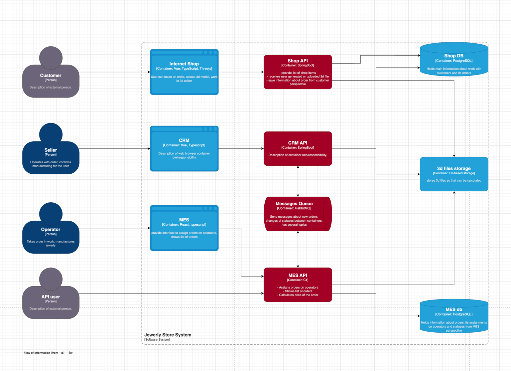

### **Анализ диаграммы**

На диаграмме отмечены сервисы, которые необходимо покрыть трейсингом:
- Shop API
- CRM API
- MES API
- RabbitMQ

В общем, это все места, где заказ может поменять статус. Покрытие трейсингом этих мест позволит точно определить на каком шаге заказ завис.
Помимо `trace_id` можно добавить в трейсинг статус заказа, название сервиса и время, которое заказ провел в этом статусе. 
Это позволит контролировать скорость обработки заказов на каждом этапе и выявить узкие места.

---

### **Мотивация**

**Проблема: нет контроля над жизненным циклом заказа**

В текущий момент компания сталкивается с рядом критических проблем, связанных с потерей заказов, задержками и сложностью диагностики.
Это приводит к следующим негативным последствиям:
1. Потеря заказов – клиент оформил заказ, но он не дошёл до CRM/MES, и никто не знает, где он пропал. 
2. Зависание заказов в системе – заказ может застрять на одном из этапов, но непонятно, где именно. 
3. Долгое расследование инцидентов – сейчас, чтобы найти проблему, разработчики вручную проверяют логи в разных сервисах.
4. Высокая нагрузка на поддержку – операторы тратят много времени на поиск информации о статусе заказа.
5. Проблемы с API – клиенты жалуются, что заказы оформляются долго, но непонятно, в каком сервисе задержка.

**Как трейсинг решает эту проблему?**
- Прозрачность обработки заказов – мы видим весь путь заказа, от оформления до доставки.
- Быстрое выявление узких мест – если заказ завис, сразу понятно, в каком сервисе. 
- Меньше жалоб от клиентов – поддержка может быстро проверить статус заказа.
- Оптимизация системы – можно увидеть, какой этап обработки заказов занимает больше всего времени.

---

### **Предлагаемое решение**

В качестве основного инструмента для трейсинга выбираем OpenTelemetry + Jaeger. Эта связка является стандартом индустрии, поддерживает Java, .NET и Vue/React и легко внедряется.

**Схема работы трейсинга в системе:**
- Когда клиент создаёт заказ, он получает уникальный `trace_id`. Вместо `trace_id` можно, например, использовать `id` заказа.
- `trace_id` передаётся через все сервисы (онлайн-магазин, CRM, MES, API).
- Каждый сервис фиксирует, когда он получил и обработал заказ.
- Jaeger используется для визуализации данных трейсинга.

**Пример**
- Клиент оформил заказ: `trace_id: XYZ123`.
- Онлайн-магазин передал в CRM: `trace_id: XYZ123, статус: SUBMITTED`.
- MES оценил модель: `trace_id: XYZ123, статус: PRICE_CALCULATED`.
- CRM передало заказ в производство: `trace_id: XYZ123, статус: MANUFACTURING_APPROVED`.
- Оператор начал производство: `trace_id: XYZ123, статус: MANUFACTURING_STARTED`.
- Заказ отправлен клиенту: `trace_id: XYZ123, статус: SHIPPED`.

---

### **Компромиссы**

- **Увеличение нагрузки на систему логирования.** Для решения этой проблемы можно ограничить срок хранения логов – например, 
трейсинг будет храниться не более 30 дней, а устаревшие данные будут архивироваться в в дешёвое хранилище (S3, ClickHouse).
- **Интеграция с MES.** MES это проприетарное ПО написанное на C#, что может вызвать сложности для внедрения трейсинга.

---

### **Безопасность**

В системе уже настроена система авторизации и ацетификации. На данном этапе можно положиться на нее, дав доступ к данным трейсинга только пользователям с определенными ролями
`DEVELOPER`, `SUPPORT_AGENT`, `MANAGER` и т.д.
