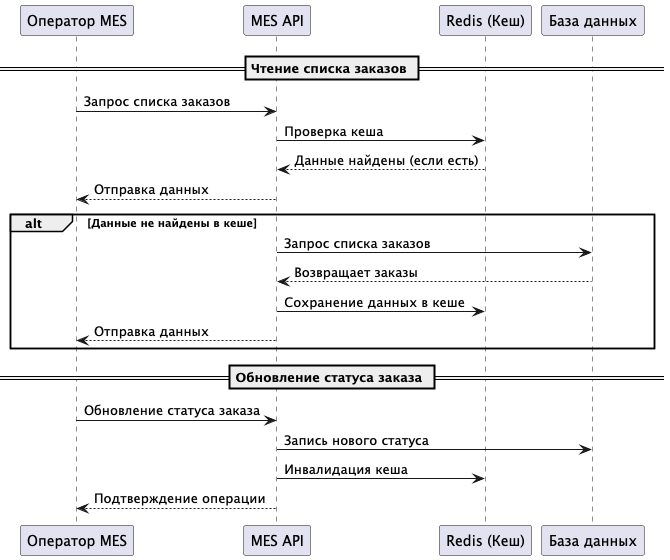

### **Мотивация**

**Проблема: долгая загрузка дашборда**

Система испытывает проблемы с производительностью, особенно в MES, где операторы сталкиваются с длительной загрузкой дашборда заказов. 
Высокая нагрузка на базу данных также приводит к увеличению времени отклика API интернет-магазина и CRM, что негативно влияет на B2B-клиентов.

**Основные проблемы, которые решает кеширование:**
- Замедленная работа MES - операторы тратят время на ожидание загрузки дашборда.
- Высокая нагрузка на базу данных - большое количество повторяющихся запросов замедляет работу системы.
- Долгое время отклика API - B2B-клиенты получают задержки при оформлении заказов.
- Задержки в расчёте стоимости заказов - MES выполняет повторные вычисления даже для одинаковых моделей изделий.

**Какие элементы системы будут кешироваться:**
- Список заказов в MES - уменьшение нагрузки при загрузке дашборда.
- Запросы к API интернет-магазина и CRM - кеширование популярных данных (каталог товаров, активные заказы).
- Расчёт стоимости заказов в MES - повторные вычисления заменяются кешированными значениями.

---

### **Предлагаемое решение**

**Выбор типа кеширования**

В системе будет использоваться серверное кеширование с Redis, так как клиентское кеширование не подходит - данные динамичные, операторы должны видеть актуальные заказы.
В свою очередь серверное кеширование позволяет уменьшить нагрузку на БД и обеспечить быстрое обновление данных.

**Выбор паттерна кеширования**

В системе будут использоваться два паттерна:
- Cache-Aside - для списка заказов в MES и API.
- Write-Through - для кеширования расчёта стоимости (чтобы всегда использовать актуальные данные).

Почему выбран Cache-Aside для списка заказов и API?

Cache-Aside работает по принципу:
1. При запросе сначала проверяется кеш.
2. Если данные найдены, они сразу возвращаются.
3. Если данных в кеше нет, выполняется запрос к базе, а затем результат сохраняется в кеш.

Этот подход выбран для списка заказов в MES и данных API, потому что обеспечивает необходимую гибкость - данные загружаются в кеш только по мере необходимости, 
что снижает нагрузку на хранилище. Так же, в кеше хранятся только востребованные данные, что позволяет оптимизировать память. 
При изменении статуса заказа кеш удаляется и обновляется при следующем запросе, следовательно, риск хранения данных устаревших данных минимален. 
Данный паттерн отлично подходит для часто изменяющихся данных - кешируется список заказов, который операторы запрашивают регулярно.

Почему не Write-Through или Refresh-Ahead?
- Write-Through не подходит, потому что не все заказы запрашиваются одинаково часто - не имеет смысла кешировать все данные, если операторы видят только активные заказы.
- Refresh-Ahead усложнит систему, так как предсказание того, какие заказы будут запрашиваться, невозможно.

Почему выбран Write-Through для расчёта стоимости заказов?

Write-Through работает следующим образом:
1. При обновлении данных новая версия записывается сразу в кеш и в базу.
2. При следующем запросе данные берутся из кеша без необходимости обращения к БД.

Этот паттерн подходит для кеширования результатов расчёта стоимости в MES, так как гарантирует актуальность данных - информация всегда совпадает с базой, так как обновляется синхронно. 
В то же время, использование данного паттерна минимизирует нагрузку на базу потому что повторные запросы к MES выполняются из кеша, а не рассчитываются заново.  
Ещё одним преимуществом является эффективность работы с редко изменяющихся данными - один и тот же расчёт стоимости может использоваться многократно без изменений.

Почему не Cache-Aside или Refresh-Ahead?
- Cache-Aside не подходит, так как запрос к БД всё равно будет выполняться при первом обращении, что снижает эффективность кеша.
- Refresh-Ahead не нужен, так как значения редко обновляются - их достаточно записывать в кеш при изменении.

**Диаграмма последовательности (Sequence Diagram)**

Диаграмма показывает, что при чтении списка заказов сначала проверяется кеш. Если данные там есть, они сразу отправляются оператору. 
Если данных нет, выполняется запрос к базе, а затем результат кешируется. 
При изменении статуса заказа кеш сбрасывается, чтобы не отображать устаревшие данные.

**Стратегия инвалидации кеша**

| Стратегия   | Описание                                                       | Почему подходит / не подходит                                     |
|-------------|----------------------------------------------------------------|-------------------------------------------------------------------|
| Временная   | Данные автоматически очищаются через заданный интервал времени | Не подходит, так как может привести к устаревшей информации в MES |
| По ключу    | Кеш сбрасывается, если изменяется связанный объект             | Используется для кеша расчёта стоимости (Write-Through)           |
| Программная | Кеш сбрасывается при изменении данных в БД                     | Основной подход для списка заказов в MES                          |

В системе будет использоваться программная инвалидация, так как:
- Позволяет гарантированно обновлять кеш при изменении данных.
- Исключает ситуацию, когда пользователи видят устаревшие заказы.
- Подходит для MES, где заказы меняют статус динамически.

Также для расчёта стоимости в MES используется по ключу инвалидация, так как данные статичны после расчёта.
